[](https://www.aicrowd.com/challenges/orak-game-agent-challenge-2025)
[](https://discord.gg/yWurtB2huX)

# Orak Game Agent Challenge 2025 Starter Kit 🎮

This repository provides a comprehensive starter kit designed to facilitate your participation. It contains the necessary tools and documentation to help you build, test, and submit a game-playing agent for this unique challenge at the intersection of AI and gaming.

We are excited to see the novel approaches and sophisticated strategies that will emerge from the community. This kit is intended to streamline the initial setup and allow you to focus on the core research and development of your agent.

---

## 📖 A Quick Refresher: The Orak Challenge

Orak is an open benchmark designed to test agentic LLMs in the complex, dynamic environments of real video games. Your task is to develop a single, MCP-connected agent that processes textual and visual state to act across five iconic titles: **Street Fighter III**, **Super Mario**, **Pokémon**, **StarCraft II**, and **2048**.

The challenge moves beyond constrained environments to evaluate an agent's planning, adaptability, and execution in real-world gaming scenarios. For a detailed understanding of the benchmark's design and objectives, we recommend reviewing the [Orak Benchmark Paper](http://arxiv.org/PDF/2506.03610).

```mermaid
%%{
  init: {
    'theme': 'base',
    'fontFamily': 'Arial, sans-serif'
  }
}%%
graph LR
    %% Define Shapes: Circles for Start/End, Rounded Rects for all else
    A((🏁 Start))
    L((🏆 End))

    B([Sign Up])
    C([Accept<br>Challenge Rules])
    
    D([Clone Starter Kit <br> 🚀 GitLab])
    
    F([Develop Agent <br> <code>agents/*.py</code>])
    G([Run Full Local Test <br> <code>uv run ... --local</code>])
    H([Check<br>Local Results])
    
    I([Run Submission <br> <code>uv run ...</code>])
    J([Evaluation on <br><b style="color:#f0524d">AIcrowd</b> ⏳])
    K([Check Leaderboard <br> 📊 <b style="color:#f0524d">AIcrowd</b>])

    %% Define Flow
    A --> B;

    subgraph "<b>1. Registration</b>"
        direction TB
        B --> C
    end

    C --> D;
    
    subgraph "<b>2. Local Setup</b>"
        direction TB
        D --> F
    end

    
    subgraph "<b>3. Local Development</b>"
        direction LR
        F --> G
        G --> H
        H -- 👎 Tweak Code --> F
    end

    H -- 👍 Looks Good! --> I;
    
    subgraph "<b>4. Submission</b>"
        direction TB
        I --> J
        J --> K
    end

    K -- Iterate ↻ --> F;
    K -- Finish --> L;

    %% Styling
    %% Apply general style to all nodes
    classDef allNodes fill:#ffffff,stroke:#f0524d,stroke-width:2px,color:#333,border-radius:20px
    class A,B,C,D,E,F,G,H,I,J,K,L allNodes
```



## 🚀 Getting Started: Environment Setup

We have designed the setup process to be as seamless as possible, enabling you to quickly begin your development.

### Step 1: Prerequisites

The only prerequisite is `uv`, a high-performance Python package installer and resolver. If you do not have it installed, please follow the [official `uv` installation guide](https://github.com/astral-sh/uv).

### Step 2: Clone This Repository

Clone the starter kit to your local machine using the following commands:

```bash
git clone git@gitlab.aicrowd.com:aicrowd/challenges/orak-game-agent-challenge-2025/orak-2025-starter-kit.git
cd orak-2025-starter-kit
```

### Step 3: Run a Local Test

With the setup complete, you can now run a full local evaluation using the provided random agent to verify your environment.

```bash
diambra run --path.roms executables/streetfighter3/roms uv run python run.py --local
```

### Step 3b: Run a Single Game (or Subset of Games) — LOCAL Mode Only

For faster iteration while developing your agent **in local mode**, you can run only one game (or a subset of games) instead of all of them at once by using the `--games` flag:

```bash
# Examples (LOCAL mode)
uv run python run.py --local --games super_mario
diambra run --path.roms executables/streetfighter3/roms uv run python run.py --local --games street_fighter
uv run python run.py --local --games pokemon_red

# You can also run multiple games:
diambra run --path.roms executables/streetfighter3/roms uv run python run.py --local --games super_mario street_fighter
```

> Note: The `--games` flag is **only supported with `--local`**. In remote/submission mode, all games are always evaluated.

Valid game identifiers are:

- `twenty_fourty_eight`
- `super_mario`
- `pokemon_red`
- `star_craft`
- `street_fighter`

A successful execution will conclude with an evaluation summary. An example output is shown below:


A successful run confirms that your environment is correctly configured, and you can now proceed with agent development.

### Switching between Live UI and plain logs

By default, the evaluation runner uses a **Rich Live UI** with a dynamic table, spinners, and a status banner.

- **Live UI (default)**: run the commands as shown above, e.g. `uv run python run.py --local`.
- **Plain logs mode**: set the `ORAK_PLAIN_LOGS` environment variable to a truthy value (`"1"`, `"true"`, `"yes"`, or `"y"`) before running, for example:

```bash
ORAK_PLAIN_LOGS=1 uv run python run.py --local
```

This switches rendering to simple line-based logs (no Live UI), which is often preferable in CI or when piping output to files. To go back to the Live UI, unset `ORAK_PLAIN_LOGS` or set it to any other value.

---

## 💻 Developing Your Agent

You can begin the core task of developing your custom agent. This is your opportunity to experiment with different models, prompting techniques, and novel strategies.

Your agent's implementation will reside in the `agents/` directory. For detailed instructions on the agent's structure, along with examples, please refer to the **[agents/README.md](agents/README.md)**.

## 🏆 Competition Workflow

The following steps outline the process from setting up this starter kit to appearing on the official leaderboard:

1.  **Registration**: Visit the [AIcrowd challenge page](https://www.aicrowd.com/challenges/orak-game-agent-challenge-2025) to officially register for the competition.
2.  **Local Setup**: Clone this repository to set up your local development environment.
3.  **Development Cycle**:
    *   **Implement Agent**: Develop your agent in the `agents/*.py` files.
    *   **Test Locally**: Run `uv run python run.py --local` to evaluate its performance.
    *   **Analyze & Iterate**: Review the local results and refine your agent's logic.
4.  **Submission**: Once satisfied with your agent's performance, submit it for official evaluation.
5.  **Leaderboard**: Track your agent's ranking on the official leaderboard and continue to iterate on your solution.

## 📮 Submitting Your Agent

When you are ready to submit your agent for official evaluation, use the same command as for local testing, but omit the `--local` flag:

```bash
export AICROWD_API_TOKEN=`<your api key from https://www.aicrowd.com/participants/me>`
uv run python run.py
```

This command will package your agent and submit it to the AIcrowd platform for scoring.

---

## 🤔 Frequently Asked Questions

...

## 🔗 Important Links

-   **Challenge Page**: [Orak Game Agent Challenge 2025](https://www.aicrowd.com/challenges/orak-game-agent-challenge-2025)
-   **Discussion Forum**: [Join the conversation](https://www.aicrowd.com/challenges/orak-game-agent-challenge-2025/discussion)
-   **Leaderboard**: [View the official leaderboard](https://www.aicrowd.com/challenges/orak-game-agent-challenge-2025/leaderboards)
-   **Contact**: ...

We wish you the best of luck and look forward to your contributions. 🎉
